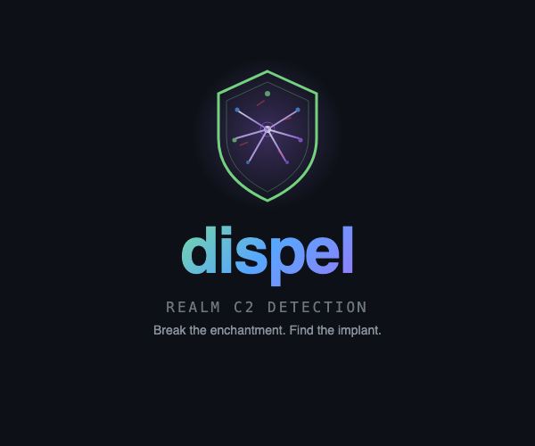
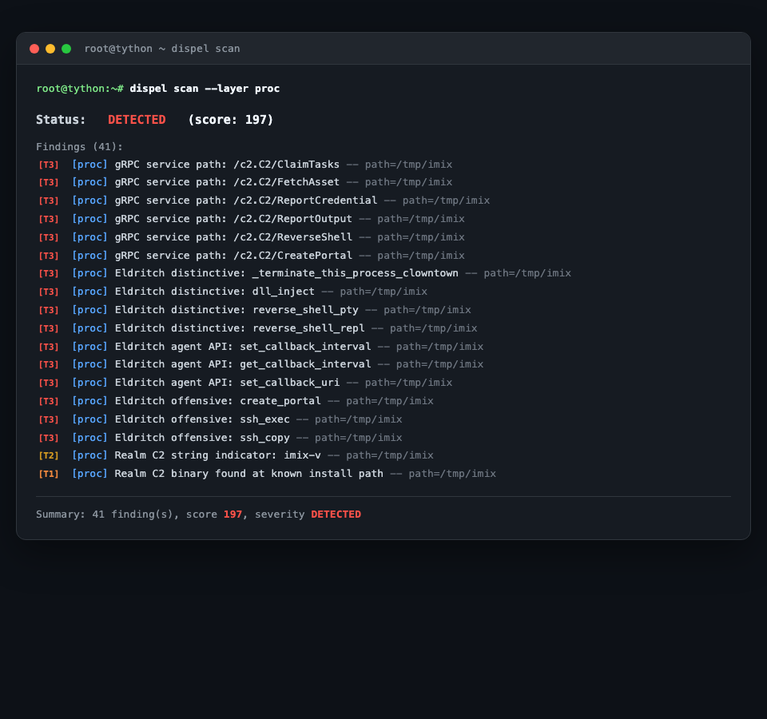

<p align="center">
  
</p>

<p align="center">
  <strong>Detect and remove <a href="https://github.com/spellshift/realm">Realm C2</a> implants.</strong>
</p>

---

## What is this?

**dispel** is a host-based detection tool that finds [Realm](https://github.com/spellshift/realm) command-and-control implants on compromised systems. It scans running processes, network connections, persistence mechanisms, and runtime behavior to identify the Realm C2 agent (imix) with high confidence and zero false positives.

Single static binary. No dependencies. Drop it on a box and run it.

<p align="center">
  
</p>

## Quick Start

```bash
# Build
cargo build --release

# Scan everything
./dispel scan

# JSON output for automation
./dispel scan --json

# Scan only processes
./dispel scan --layer proc

# Continuous monitoring (10s interval)
./dispel watch --interval 10
```

## Detection Layers

| Layer | What it detects |
|-------|----------------|
| **proc** | Scans live process binaries for Realm signatures using Aho-Corasick multi-pattern matching. Checks known install paths (`/tmp/imix`, `/bin/imix`, etc.). Flags deleted executables and high thread counts. |
| **net** | Identifies Realm gRPC service paths (`/c2.C2/ClaimTasks`, `/c2.C2/ReverseShell`, etc.) in traffic. Detects DNS tunneling via base32-encoded subdomains. Flags high-entropy prefixes (X25519 pubkey + XChaCha20 nonce). Monitors for beaconing patterns. |
| **persist** | Finds beacon ID files (UUID v4 at known paths). Checks systemd units, sysvinit scripts, and Windows registry/services for Realm service names. Detects timestomped binaries. |
| **behavior** | Identifies shell processes with socket-redirected file descriptors (reverse shells). Flags recent `/etc/shadow` access (credential harvesting). |

## Confidence Scoring

Every finding has a tier that reflects how conclusive it is:

| Tier | Weight | Meaning | Examples |
|------|--------|---------|----------|
| **T3** | 5 | Conclusive | gRPC paths like `/c2.C2/ClaimTasks`, Eldritch functions like `_terminate_this_process_clowntown` |
| **Behavioral** | 4 | Suspicious runtime behavior | Reverse shell indicators, shadow file access |
| **T2** | 3 | Strong indicator | `imix-v`, `eldritch::`, `ChachaCodec` strings |
| **T1** | 1 | Definitive artifact | Binary at `/tmp/imix`, service named `imix` |

Scores are summed to produce a severity:

- **CLEAN** (0) — No indicators
- **SUSPECT** (1-4) — Low-confidence, worth investigating
- **DETECTED** (5+) — High-confidence Realm C2 presence

Exit codes: `0` = clean, `1` = suspect, `2` = detected.

## Signatures

dispel detects Realm C2 through signatures extracted from the [spellshift/realm](https://github.com/spellshift/realm) source code:

- **8 gRPC service paths** from the C2 proto definition (`/c2.C2/ClaimTasks`, `/c2.C2/ReverseShell`, etc.)
- **5 Eldritch distinctive functions** (`_terminate_this_process_clowntown`, `dll_inject`, `dll_reflect`, `reverse_shell_pty`, `reverse_shell_repl`)
- **6 Eldritch agent API functions** (`report_credential`, `set_callback_interval`, etc.)
- **6 Eldritch report module paths** (`report::file`, `report::ntlm_hash`, etc.)
- **3 offensive capability names** (`create_portal`, `ssh_exec`, `ssh_copy`)
- **8 Tier 2 string indicators** (`imix-v`, `eldritch::`, `ChachaCodec`, `KIND_NTLM_HASH`, etc.)

All signatures are scanned simultaneously using an [Aho-Corasick](https://en.wikipedia.org/wiki/Aho%E2%80%93Corasick_algorithm) automaton for efficient multi-pattern matching over memory-mapped binaries.

## Platform Support

| Platform | Process Scanning | Network | Persistence | Behavior |
|----------|-----------------|---------|-------------|----------|
| Linux | Full | Full | Full | Full |
| Windows | Full | Full | Full | Stub |
| BSD | Stub | Stub | Partial | Stub |
| macOS | Build only | Build only | Build only | Build only |

## Cross-Compilation

Build for Linux from macOS (requires [zig](https://ziglang.org/) and [cargo-zigbuild](https://github.com/rust-cross/cargo-zigbuild)):

```bash
cargo zigbuild --release --target x86_64-unknown-linux-gnu
```

## Allowlists

Suppress known-good findings with an allowlist file:

```
# Allow known infrastructure
ip 192.168.1.10
ip 10.0.0.5
proc sshd
proc systemd-resolved
```

```bash
./dispel scan --allowlist /etc/dispel/allowlist.conf
```

## Watch Mode

Continuous monitoring with deduplication (findings suppressed for 300s after first report):

```bash
# Human-readable alerts
./dispel watch --interval 10

# JSON lines for log ingestion
./dispel watch --interval 10 --json

# Diff against a known-good baseline
./dispel scan --json > baseline.json
./dispel watch --baseline baseline.json
```

## License

MIT
